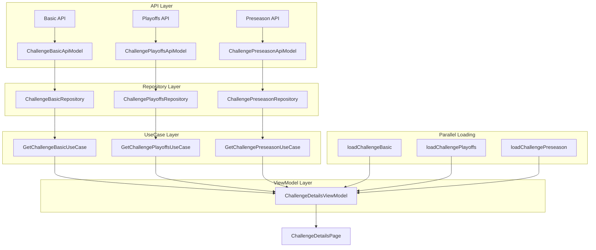

# Challenge Details Page 改造计划

## 📋 改造目标

将 `challenge_details_page.dart` 页面中的所有硬编码数据统一通过一个API请求获取，实现数据驱动的架构设计。

## 🔍 当前页面数据分析

### 1. 需要改造的数据结构

#### 1.1 Playoff 相关数据
- `const Map<PlayoffStage, String> playoffStageNames` - 季后赛阶段名称映射
- `final Map<PlayoffStage, List<PlayoffMatch>> playoffData` - 季后赛对阵数据
- `PlayoffMatch` 类 - 对阵信息结构

#### 1.2 规则数据
- `final List<String> _rules` - 挑战规则列表

#### 1.3 游戏追踪数据
- `final List<Map<String, dynamic>> posts` - 游戏追踪动态列表

#### 1.4 季前赛记录数据
- `final records` - 季前赛记录列表
- `final String notice` - 季前赛公告内容

#### 1.5 视频数据
- `'assets/video/video1.mp4'` - 视频介绍URL

## 🏗️ 拆分API数据结构设计

为了提高容错率和用户体验，将原来的单一API拆分为三个独立的API：

### 1. 挑战基础信息API

**接口**: `GET /api/challenge/{challengeId}/basic`

**响应数据结构**:
```json
{
  "code": "A200",
  "message": "Success",
  "data": {
    "challengeId": "challenge_001",
    "challengeName": "10 SEC MAX Challenge",
    "backgroundImage": "assets/images/player_cover.png",
    "videoUrl": "assets/video/video1.mp4",
    "preseasonNotice": "Preseason is for warm-up and fun! Results here do not affect the official playoffs. Enjoy and challenge yourself!",
    "rules": {
      "title": "Challenge Rules",
      "items": [
        "1. Complete the daily workout to earn points.",
        "2. Rankings are based on total points.",
        "3. Top 3 will receive exclusive rewards!"
      ],
      "details": "Here you can provide a more detailed description of the challenge rules, scoring, rewards, and any other information participants should know.\n\nYou can also add links, images, or FAQs as needed."
    },
    "gameTracker": {
      "posts": [
        {
          "id": "post_001",
          "announcement": "🏆 Congratulations!\nYou are the WINNER of the 10 SEC MAX Challenge!",
          "image": "assets/images/player_cover.png",
          "desc": "Share your achievement with friends and stay tuned for the next challenge!",
          "timestep": 1754744558066
        },
        {
          "id": "post_002",
          "announcement": "🔥 New Record!\nYou hit 50 punches in 10 seconds!",
          "image": "assets/images/avatar_default.png",
          "desc": "Keep pushing your limits and break more records!",
          "timestep": 1754744558066
        }
      ]
    }
  }
}
```

### 2. 季后赛数据API

**接口**: `GET /api/challenge/{challengeId}/playoffs`

**响应数据结构**:
```json
{
  "code": "A200",
  "message": "Success",
  "data": {
    "challengeId": "challenge_001",
    "stages": {
      "round32": "1/32 PLAYOFF",
      "round16": "1/16 FINALS",
      "round8": "1/8 FINALS",
      "round4": "1/4 FINALS",
      "semi": "SEMI FINAL",
      "finalMatch": "FINAL"
    },
    "matches": {
      "round32": [
        {
          "userId1": "user_001",
          "avatar1": "https://randomuser.me/api/portraits/men/1.jpg",
          "name1": "Player1",
          "userId2": "user_002",
          "avatar2": "https://randomuser.me/api/portraits/men/2.jpg",
          "name2": "Player2",
          "score1": 45,
          "score2": 41,
          "finished": true
        }
      ],
      "round16": [
        {
          "userId1": "user_015",
          "avatar1": "https://randomuser.me/api/portraits/men/15.jpg",
          "name1": "Player15",
          "userId2": "user_016",
          "avatar2": "https://randomuser.me/api/portraits/men/16.jpg",
          "name2": "Player16",
          "score1": 42,
          "score2": 38,
          "finished": true
        },
        {
          "userId1": "user_017",
          "avatar1": "https://randomuser.me/api/portraits/men/17.jpg",
          "name1": "Player17",
          "userId2": "user_018",
          "avatar2": "https://randomuser.me/api/portraits/men/18.jpg",
          "name2": "Player18",
          "score1": 39,
          "score2": 44,
          "finished": true
        }
      ],
      "round8": [
        {
          "userId1": "user_003",
          "avatar1": "https://randomuser.me/api/portraits/men/1.jpg",
          "name1": "Karateboxarwjs",
          "userId2": "user_004",
          "avatar2": "https://randomuser.me/api/portraits/men/2.jpg",
          "name2": "JaylenF",
          "score1": 45,
          "score2": 41,
          "finished": true
        }
      ],
      "round4": [
        {
          "userId1": "user_005",
          "avatar1": "https://randomuser.me/api/portraits/men/5.jpg",
          "name1": "Player5",
          "userId2": "user_006",
          "avatar2": "https://randomuser.me/api/portraits/men/6.jpg",
          "name2": "Player6",
          "score1": null,
          "score2": null,
          "finished": false
        }
      ],
      "semi": [
        {
          "userId1": "user_007",
          "avatar1": "https://randomuser.me/api/portraits/men/7.jpg",
          "name1": "Player7",
          "userId2": "user_008",
          "avatar2": "https://randomuser.me/api/portraits/men/8.jpg",
          "name2": "Player8",
          "score1": null,
          "score2": null,
          "finished": false
        }
      ],
      "finalMatch": [
        {
          "userId1": "user_009",
          "avatar1": "https://randomuser.me/api/portraits/men/9.jpg",
          "name1": "Player9",
          "userId2": "user_010",
          "avatar2": "https://randomuser.me/api/portraits/men/10.jpg",
          "name2": "Player10",
          "score1": null,
          "score2": null,
          "finished": false
        }
      ]
    }
  }
}
```

### 3. 季前赛数据API

**接口**: `GET /api/challenge/{challengeId}/preseason`

**请求参数**:
- `page` 整数，页码（从1开始，默认1）
- `size` 整数，每页大小（默认10）

**响应数据结构**:
```json
{
  "code": "A200",
  "message": "Success",
  "data": {
    "challengeId": "challenge_001",
    "records": [
      {
        "id": "record_001",
        "index": 1,
        "name": "HIIT 7-Day Challenge",
        "counts": 42,
        "rank": "2nd"
      },
      {
        "id": "record_002",
        "index": 2,
        "name": "Yoga Masters Cup",
        "counts": 38,
        "rank": "1st"
      }
    ],
    "total": 25,
    "currentPage": 1,
    "pageSize": 10
  }
}
```

### 🎯 API拆分优势

1. **提高容错率**: 单个API失败不会影响整个页面
2. **并行加载**: 三个API可以同时发起请求，提升加载速度
3. **按需加载**: 用户可以先看到基础信息，其他数据逐步加载
4. **缓存策略**: 可以为不同数据设置不同的缓存策略
5. **错误隔离**: 每个API的错误可以独立处理和重试

## 📁 文件结构设计

### 1. Domain 层

#### 1.1 领域实体 (Entities)
```
lib/domain/entities/
├── challenge_details.dart          # 挑战详情主实体
├── playoff_match.dart             # 季后赛对阵实体
├── game_tracker_post.dart         # 游戏追踪动态实体
└── preseason_record.dart          # 季前赛记录实体
```

#### 1.2 领域服务 (Services)
```
lib/domain/services/
└── challenge_details_service.dart  # 挑战详情业务逻辑服务
```

#### 1.3 用例 (UseCases)
```
lib/domain/usecases/
├── get_challenge_basic_usecase.dart      # 获取挑战基础信息用例
├── get_challenge_playoffs_usecase.dart   # 获取季后赛数据用例
└── get_challenge_preseason_usecase.dart  # 获取季前赛数据用例
```

### 2. Data 层

#### 2.1 API 模型 (Models)
```
lib/data/models/
├── challenge_basic_api_model.dart        # 挑战基础信息API模型
├── challenge_playoffs_api_model.dart     # 季后赛数据API模型
├── challenge_preseason_api_model.dart    # 季前赛数据API模型
├── playoff_match_api_model.dart          # 季后赛对阵API模型
├── game_tracker_post_api_model.dart      # 游戏追踪动态API模型
└── preseason_record_api_model.dart       # 季前赛记录API模型
```

#### 2.2 API 接口 (API)
```
lib/data/api/
├── challenge_basic_api.dart             # 挑战基础信息API接口
├── challenge_playoffs_api.dart          # 季后赛数据API接口
└── challenge_preseason_api.dart         # 季前赛数据API接口
```

#### 2.3 仓库 (Repository)
```
lib/data/repository/
├── challenge_basic_repository.dart      # 挑战基础信息数据仓库
├── challenge_playoffs_repository.dart   # 季后赛数据仓库
└── challenge_preseason_repository.dart  # 季前赛数据仓库
```

### 3. Presentation 层

#### 3.1 页面和ViewModel
```
lib/presentation/challenge_details/
├── challenge_details_page.dart          # 挑战详情页面 (改造后)
├── challenge_details_viewmodel.dart     # 挑战详情ViewModel
└── widgets/                             # 页面组件
    ├── rule_card.dart
    ├── feature_entry_card.dart
    ├── game_tracker_tab.dart
    ├── preseason_tab.dart
    ├── playoff_bracket.dart
    └── full_screen_video_page.dart
```

## 🔧 改造步骤

### 步骤 1: 创建 Domain 层实体

#### 1.1 challenge_details.dart
```dart
class ChallengeDetails {
  final String challengeId;
  final String challengeName;
  final String backgroundImage;
  final String videoUrl;
  final ChallengeRules rules;
  final PlayoffData playoffs;
  final PreseasonData preseason;
  final GameTrackerData gameTracker;

  ChallengeDetails({
    required this.challengeId,
    required this.challengeName,
    required this.backgroundImage,
    required this.videoUrl,
    required this.rules,
    required this.playoffs,
    required this.preseason,
    required this.gameTracker,
  });
}

class ChallengeBasic {
  final String challengeId;
  final String challengeName;
  final String backgroundImage;
  final String videoUrl;
  final String preseasonNotice;  // 新增：季前赛公告
  final ChallengeRules rules;
  final GameTrackerData gameTracker;

  ChallengeBasic({
    required this.challengeId,
    required this.challengeName,
    required this.backgroundImage,
    required this.videoUrl,
    required this.preseasonNotice,  // 新增
    required this.rules,
    required this.gameTracker,
  });
}

class ChallengeRules {
  final String title;
  final List<String> items;
  final String details;

  ChallengeRules({
    required this.title,
    required this.items,
    required this.details,
  });
}

class PlayoffData {
  final Map<String, String> stages;
  final Map<String, List<PlayoffMatch>> matches;

  PlayoffData({
    required this.stages,
    required this.matches,
  });
}

class PreseasonData {
  final List<PreseasonRecord> records;
  final PaginationInfo pagination;  // 新增：分页信息

  PreseasonData({
    required this.records,
    required this.pagination,
  });
}

class PaginationInfo {
  final int total;
  final int currentPage;
  final int pageSize;
  final int totalPages;

  PaginationInfo({
    required this.total,
    required this.currentPage,
    required this.pageSize,
    required this.totalPages,
  });
}

class GameTrackerData {
  final List<GameTrackerPost> posts;

  GameTrackerData({
    required this.posts,
  });
}
```

#### 1.2 playoff_match.dart
```dart
class PlayoffMatch {
  final String? userId1;
  final String? avatar1;
  final String? name1;
  final String? userId2;
  final String? avatar2;
  final String? name2;
  final int? score1;
  final int? score2;
  final bool finished;

  PlayoffMatch({
    this.userId1,
    this.avatar1,
    this.name1,
    this.userId2,
    this.avatar2,
    this.name2,
    this.score1,
    this.score2,
    this.finished = false,
  });
}
```

#### 1.3 game_tracker_post.dart
```dart
class GameTrackerPost {
  final String id;
  final String? announcement;
  final String? image;
  final String? desc;
  final DateTime timestep;

  GameTrackerPost({
    required this.id,
    this.announcement,
    this.image,
    this.desc,
    required this.timestep,
  });
}
```

#### 1.4 preseason_record.dart
```dart
class PreseasonRecord {
  final String id;
  final int index;
  final String name;
  final String rank;

  PreseasonRecord({
    required this.id,
    required this.index,
    required this.name,
    required this.rank,
  });
}
```

### 步骤 2: 创建 Data 层

#### 2.1 challenge_basic_api_model.dart
```dart
class ChallengeBasicApiModel {
  final String challengeId;
  final String challengeName;
  final String backgroundImage;
  final String videoUrl;
  final String preseasonNotice;  // 新增：季前赛公告
  final ChallengeRulesApiModel rules;
  final GameTrackerDataApiModel gameTracker;

  ChallengeBasicApiModel({
    required this.challengeId,
    required this.challengeName,
    required this.backgroundImage,
    required this.videoUrl,
    required this.preseasonNotice,  // 新增
    required this.rules,
    required this.gameTracker,
  });

  factory ChallengeBasicApiModel.fromJson(Map<String, dynamic> json) {
    return ChallengeBasicApiModel(
      challengeId: json['challengeId'] as String,
      challengeName: json['challengeName'] as String,
      backgroundImage: json['backgroundImage'] as String,
      videoUrl: json['videoUrl'] as String,
      preseasonNotice: json['preseasonNotice'] as String? ?? '',  // 新增
      rules: ChallengeRulesApiModel.fromJson(json['rules']),
      gameTracker: GameTrackerDataApiModel.fromJson(json['gameTracker']),
    );
  }
}
```

#### 2.2 challenge_playoffs_api_model.dart
```dart
class ChallengePlayoffsApiModel {
  final String challengeId;
  final Map<String, String> stages;
  final Map<String, List<PlayoffMatchApiModel>> matches;

  ChallengePlayoffsApiModel({
    required this.challengeId,
    required this.stages,
    required this.matches,
  });

  factory ChallengePlayoffsApiModel.fromJson(Map<String, dynamic> json) {
    return ChallengePlayoffsApiModel(
      challengeId: json['challengeId'] as String,
      stages: Map<String, String>.from(json['stages']),
      matches: (json['matches'] as Map<String, dynamic>).map(
        (key, value) => MapEntry(
          key,
          (value as List).map((e) => PlayoffMatchApiModel.fromJson(e)).toList(),
        ),
      ),
    );
  }
}
```

#### 2.3 challenge_preseason_api_model.dart
```dart
class ChallengePreseasonApiModel {
  final String challengeId;
  final List<PreseasonRecordApiModel> records;
  final PaginationInfoApiModel pagination;  // 新增：分页信息

  ChallengePreseasonApiModel({
    required this.challengeId,
    required this.records,
    required this.pagination,  // 新增
  });

  factory ChallengePreseasonApiModel.fromJson(Map<String, dynamic> json) {
    return ChallengePreseasonApiModel(
      challengeId: json['challengeId'] as String,
      records: (json['records'] as List)
          .map((e) => PreseasonRecordApiModel.fromJson(e))
          .toList(),
      pagination: PaginationInfoApiModel.fromJson(json['pagination']),  // 新增
    );
  }
}

class PaginationInfoApiModel {
  final int total;
  final int currentPage;
  final int pageSize;
  final int totalPages;

  PaginationInfoApiModel({
    required this.total,
    required this.currentPage,
    required this.pageSize,
    required this.totalPages,
  });

  factory PaginationInfoApiModel.fromJson(Map<String, dynamic> json) {
    return PaginationInfoApiModel(
      total: json['total'] as int,
      currentPage: json['currentPage'] as int,
      pageSize: json['pageSize'] as int,
      totalPages: json['totalPages'] as int,
    );
  }
}
```

#### 2.4 challenge_basic_api.dart
```dart
class ChallengeBasicApi {
  final Dio _dio = DioClient().dio;

  Future<ChallengeBasicApiModel> fetchChallengeBasic(String challengeId) async {
    final response = await _dio.get('/api/challenge/$challengeId/basic');
    if (response.statusCode == 200 && response.data['code'] == 'A200') {
      return ChallengeBasicApiModel.fromJson(response.data['data']);
    } else {
      throw Exception(response.data['message'] ?? 'Unknown error');
    }
  }
}
```

#### 2.5 challenge_playoffs_api.dart
```dart
class ChallengePlayoffsApi {
  final Dio _dio = DioClient().dio;

  Future<ChallengePlayoffsApiModel> fetchChallengePlayoffs(String challengeId) async {
    final response = await _dio.get('/api/challenge/$challengeId/playoffs');
    if (response.statusCode == 200 && response.data['code'] == 'A200') {
      return ChallengePlayoffsApiModel.fromJson(response.data['data']);
    } else {
      throw Exception(response.data['message'] ?? 'Unknown error');
    }
  }
}
```

#### 2.6 challenge_preseason_api.dart
```dart
class ChallengePreseasonApi {
  final Dio _dio = DioClient().dio;

  Future<ChallengePreseasonApiModel> fetchChallengePreseason(
    String challengeId, {
    int page = 1,
    int size = 10,
  }) async {
    final response = await _dio.get(
      '/api/challenge/$challengeId/preseason',
      queryParameters: {
        'page': page,
        'size': size,
      },
    );
    if (response.statusCode == 200 && response.data['code'] == 'A200') {
      return ChallengePreseasonApiModel.fromJson(response.data['data']);
    } else {
      throw Exception(response.data['message'] ?? 'Unknown error');
    }
  }
}
```

#### 2.7 challenge_basic_repository.dart
```dart
class ChallengeBasicRepository {
  final ChallengeBasicApi _challengeBasicApi;

  ChallengeBasicRepository(this._challengeBasicApi);

  Future<ChallengeBasic> getChallengeBasic(String challengeId) async {
    final ChallengeBasicApiModel apiModel = await _challengeBasicApi.fetchChallengeBasic(challengeId);
    
    return ChallengeBasic(
      challengeId: apiModel.challengeId,
      challengeName: apiModel.challengeName,
      backgroundImage: apiModel.backgroundImage,
      videoUrl: apiModel.videoUrl,
      rules: _convertRules(apiModel.rules),
      gameTracker: _convertGameTracker(apiModel.gameTracker),
    );
  }

  ChallengeRules _convertRules(ChallengeRulesApiModel apiModel) {
    return ChallengeRules(
      title: apiModel.title,
      items: apiModel.items,
      details: apiModel.details,
    );
  }

  GameTrackerData _convertGameTracker(GameTrackerDataApiModel apiModel) {
    return GameTrackerData(
      posts: apiModel.posts.map((post) => GameTrackerPost(
        id: post.id,
        announcement: post.announcement,
        image: post.image,
        desc: post.desc,
        timestep: post.timestep,
      )).toList(),
    );
  }
}
```

#### 2.8 challenge_playoffs_repository.dart
```dart
class ChallengePlayoffsRepository {
  final ChallengePlayoffsApi _challengePlayoffsApi;

  ChallengePlayoffsRepository(this._challengePlayoffsApi);

  Future<PlayoffData> getChallengePlayoffs(String challengeId) async {
    final ChallengePlayoffsApiModel apiModel = await _challengePlayoffsApi.fetchChallengePlayoffs(challengeId);
    
    return PlayoffData(
      stages: apiModel.stages,
      matches: _convertMatches(apiModel.matches),
    );
  }

  Map<String, List<PlayoffMatch>> _convertMatches(Map<String, List<PlayoffMatchApiModel>> apiMatches) {
    return apiMatches.map((key, value) => MapEntry(
      key,
      value.map((match) => PlayoffMatch(
        userId1: match.userId1,
        avatar1: match.avatar1,
        name1: match.name1,
        userId2: match.userId2,
        avatar2: match.avatar2,
        name2: match.name2,
        score1: match.score1,
        score2: match.score2,
        finished: match.finished,
      )).toList(),
    ));
  }
}
```

#### 2.9 challenge_preseason_repository.dart
```dart
class ChallengePreseasonRepository {
  final ChallengePreseasonApi _challengePreseasonApi;

  ChallengePreseasonRepository(this._challengePreseasonApi);

  Future<PreseasonData> getChallengePreseason(
    String challengeId, {
    int page = 1,
    int size = 10,
  }) async {
    final ChallengePreseasonApiModel apiModel = await _challengePreseasonApi.fetchChallengePreseason(
      challengeId,
      page: page,
      size: size,
    );
    
    return PreseasonData(
      records: apiModel.records.map((record) => PreseasonRecord(
        id: record.id,
        index: record.index,
        name: record.name,
        rank: record.rank,
      )).toList(),
      pagination: PaginationInfo(
        total: apiModel.pagination.total,
        currentPage: apiModel.pagination.currentPage,
        pageSize: apiModel.pagination.pageSize,
        totalPages: apiModel.pagination.totalPages,
      ),
    );
  }
}
```

### 步骤 3: 创建 Domain 层用例

#### 3.1 get_challenge_basic_usecase.dart
```dart
class GetChallengeBasicUseCase {
  final ChallengeBasicRepository repository;

  GetChallengeBasicUseCase(this.repository);

  Future<ChallengeBasic> execute(String challengeId) {
    return repository.getChallengeBasic(challengeId);
  }
}
```

#### 3.2 get_challenge_playoffs_usecase.dart
```dart
class GetChallengePlayoffsUseCase {
  final ChallengePlayoffsRepository repository;

  GetChallengePlayoffsUseCase(this.repository);

  Future<PlayoffData> execute(String challengeId) {
    return repository.getChallengePlayoffs(challengeId);
  }
}
```

#### 3.3 get_challenge_preseason_usecase.dart
```dart
class GetChallengePreseasonUseCase {
  final ChallengePreseasonRepository repository;

  GetChallengePreseasonUseCase(this.repository);

  Future<PreseasonData> execute(
    String challengeId, {
    int page = 1,
    int size = 10,
  }) {
    return repository.getChallengePreseason(
      challengeId,
      page: page,
      size: size,
    );
  }
}
```

### 步骤 4: 创建 Presentation 层

#### 4.1 challenge_details_viewmodel.dart
```dart
class ChallengeDetailsViewModel extends ChangeNotifier {
  final GetChallengeBasicUseCase getChallengeBasicUseCase;
  final GetChallengePlayoffsUseCase getChallengePlayoffsUseCase;
  final GetChallengePreseasonUseCase getChallengePreseasonUseCase;

  // 基础信息
  ChallengeBasic? challengeBasic;
  bool isBasicLoading = false;
  String? basicError;

  // 季后赛数据
  PlayoffData? playoffData;
  bool isPlayoffsLoading = false;
  String? playoffsError;

  // 季前赛数据
  PreseasonData? preseasonData;
  bool isPreseasonLoading = false;
  String? preseasonError;

  ChallengeDetailsViewModel({
    required this.getChallengeBasicUseCase,
    required this.getChallengePlayoffsUseCase,
    required this.getChallengePreseasonUseCase,
  });

  /// 加载挑战基础信息
  Future<void> loadChallengeBasic(String challengeId) async {
    try {
      isBasicLoading = true;
      basicError = null;
      notifyListeners();

      challengeBasic = await getChallengeBasicUseCase.execute(challengeId);
    } catch (e) {
      basicError = e.toString();
      challengeBasic = null;
    } finally {
      isBasicLoading = false;
      notifyListeners();
    }
  }

  /// 加载季后赛数据
  Future<void> loadChallengePlayoffs(String challengeId) async {
    try {
      isPlayoffsLoading = true;
      playoffsError = null;
      notifyListeners();

      playoffData = await getChallengePlayoffsUseCase.execute(challengeId);
    } catch (e) {
      playoffsError = e.toString();
      playoffData = null;
    } finally {
      isPlayoffsLoading = false;
      notifyListeners();
    }
  }

  /// 加载季前赛数据
  Future<void> loadChallengePreseason(String challengeId, {int page = 1}) async {
    try {
      isPreseasonLoading = true;
      preseasonError = null;
      notifyListeners();

      if (page == 1) {
        // 第一页：替换数据
        preseasonData = await getChallengePreseasonUseCase.execute(challengeId, page: page);
      } else {
        // 后续页：追加数据
        final newData = await getChallengePreseasonUseCase.execute(challengeId, page: page);
        if (preseasonData != null && newData != null) {
          // 合并记录
          final combinedRecords = [...preseasonData!.records, ...newData.records];
          // 更新分页信息
          preseasonData = PreseasonData(
            records: combinedRecords,
            pagination: newData.pagination,
          );
        } else {
          preseasonData = newData;
        }
      }
    } catch (e) {
      preseasonError = e.toString();
      if (page == 1) {
        preseasonData = null;
      }
    } finally {
      isPreseasonLoading = false;
      notifyListeners();
    }
  }

  /// 加载季前赛下一页数据
  Future<void> loadChallengePreseasonNextPage(String challengeId) async {
    if (preseasonData != null && 
        preseasonData!.pagination.currentPage < preseasonData!.pagination.totalPages) {
      await loadChallengePreseason(
        challengeId, 
        page: preseasonData!.pagination.currentPage + 1,
      );
    }
  }

  /// 并行加载所有数据
  Future<void> loadAllData(String challengeId) async {
    await Future.wait([
      loadChallengeBasic(challengeId),
      loadChallengePlayoffs(challengeId),
      loadChallengePreseason(challengeId),
    ]);
  }

  /// 检查是否有任何数据加载失败
  bool get hasAnyError => basicError != null || playoffsError != null || preseasonError != null;

  /// 检查是否所有数据都在加载中
  bool get isAllLoading => isBasicLoading && isPlayoffsLoading && isPreseasonLoading;

  /// 获取挑战名称
  String get challengeName => challengeBasic?.challengeName ?? '';

  /// 获取背景图片
  String get backgroundImage => challengeBasic?.backgroundImage ?? '';

  /// 获取视频URL
  String get videoUrl => challengeBasic?.videoUrl ?? '';

  /// 获取规则数据
  ChallengeRules? get rules => challengeBasic?.rules;

  /// 获取游戏追踪数据
  GameTrackerData? get gameTracker => challengeBasic?.gameTracker;
}
```

#### 4.2 challenge_details_page.dart (改造后)
```dart
class ChallengeDetailsPage extends StatefulWidget {
  const ChallengeDetailsPage({Key? key}) : super(key: key);

  @override
  State<ChallengeDetailsPage> createState() => ChallengeDetailsPageState();
}

class ChallengeDetailsPageState extends State<ChallengeDetailsPage> with SingleTickerProviderStateMixin {
  late TabController _tabController;
  late ChallengeDetailsViewModel _viewModel;

  @override
  void initState() {
    super.initState();
    _tabController = TabController(length: 3, vsync: this);
    
    // 获取挑战ID参数
    final args = ModalRoute.of(context)?.settings.arguments as Map<String, dynamic>?;
    final challengeId = args?['challengeId'] as String? ?? 'default';
    
    // 并行加载所有数据
    _viewModel.loadAllData(challengeId);
  }

  @override
  Widget build(BuildContext context) {
    return ChangeNotifierProvider.value(
      value: _viewModel,
      child: Consumer<ChallengeDetailsViewModel>(
        builder: (context, viewModel, child) {
          // 显示加载状态
          if (viewModel.isAllLoading) {
            return const Scaffold(
              body: Center(child: CircularProgressIndicator()),
            );
          }

          return Scaffold(
            backgroundColor: Colors.white,
            body: NestedScrollView(
              headerSliverBuilder: (context, innerBoxIsScrolled) => [
                // 使用 challengeBasic 数据构建头部UI
                _buildHeader(viewModel),
              ],
              body: TabBarView(
                controller: _tabController,
                children: [
                  // 游戏追踪标签页 - 使用基础信息中的gameTracker数据
                  GameTrackerTab(
                    posts: viewModel.gameTracker?.posts ?? [],
                    isLoading: viewModel.isBasicLoading,
                    error: viewModel.basicError,
                    onRetry: () => _viewModel.loadChallengeBasic(challengeId),
                  ),
                  // 季前赛标签页 - 使用季前赛数据
                  PreseasonTab(
                    preseason: viewModel.preseasonData,
                    isLoading: viewModel.isPreseasonLoading,
                    error: viewModel.preseasonError,
                    onRetry: () => _viewModel.loadChallengePreseason(challengeId),
                    onLoadMore: () => _viewModel.loadChallengePreseasonNextPage(challengeId),
                  ),
                  // 季后赛标签页 - 使用季后赛数据
                  PlayoffBracket(
                    playoffs: viewModel.playoffData,
                    isLoading: viewModel.isPlayoffsLoading,
                    error: viewModel.playoffsError,
                    onRetry: () => _viewModel.loadChallengePlayoffs(challengeId),
                  ),
                ],
              ),
            ),
          );
        },
      ),
    );
  }

  Widget _buildHeader(ChallengeDetailsViewModel viewModel) {
    // 构建头部UI，使用基础信息数据
    if (viewModel.isBasicLoading) {
      return SliverAppBar(
        expandedHeight: 200,
        floating: false,
        pinned: true,
        flexibleSpace: FlexibleSpaceBar(
          background: Container(
            color: Colors.grey[300],
            child: const Center(child: CircularProgressIndicator()),
          ),
        ),
      );
    }

    if (viewModel.basicError != null) {
      return SliverAppBar(
        expandedHeight: 200,
        floating: false,
        pinned: true,
        flexibleSpace: FlexibleSpaceBar(
          background: Container(
            color: Colors.red[100],
            child: Center(
              child: Column(
                mainAxisAlignment: MainAxisAlignment.center,
                children: [
                  Text('Error: ${viewModel.basicError}'),
                  ElevatedButton(
                    onPressed: () => _viewModel.loadChallengeBasic(challengeId),
                    child: const Text('Retry'),
                  ),
                ],
              ),
            ),
          ),
        ),
      );
    }

    // 正常显示头部UI
    return SliverAppBar(
      expandedHeight: 200,
      floating: false,
      pinned: true,
      flexibleSpace: FlexibleSpaceBar(
        background: Image.asset(
          viewModel.backgroundImage,
          fit: BoxFit.cover,
        ),
        title: Text(viewModel.challengeName),
      ),
    );
  }
}
```

## 📋 更新总结

### 🔄 主要更新内容

1. **API架构重构**：
   - 将原来的单一API拆分为三个独立API，提高容错率
   - 基础信息API：包含挑战名称、背景图片、视频URL、规则和游戏追踪数据
   - 季后赛API：包含季后赛阶段和对阵数据
   - 季前赛API：包含季前赛公告和记录数据

2. **数据结构优化**：
   - 为所有季后赛阶段添加了 `userId1` 和 `userId2` 字段
   - 为季前赛记录和游戏追踪动态添加了 `id` 字段
   - 完善了各阶段的示例数据结构

3. **架构优势**：
   - **提高容错率**：单个API失败不会影响整个页面
   - **并行加载**：三个API可以同时发起请求，提升加载速度
   - **按需加载**：用户可以先看到基础信息，其他数据逐步加载
   - **错误隔离**：每个API的错误可以独立处理和重试

### 🎯 新的架构优势

1. **容错性提升**：网络问题只会影响特定数据，不会导致整个页面失败
2. **性能优化**：并行加载多个API，减少总体等待时间
3. **用户体验**：基础信息快速显示，其他数据逐步加载
4. **维护性**：每个API独立维护，便于调试和优化
5. **扩展性**：未来可以轻松添加新的数据API

### 📊 新的数据流转架构



### 🚀 实施建议

1. **分阶段实施**：可以先实现基础信息API，再逐步添加其他API
2. **错误处理策略**：为每个API设置独立的错误处理和重试机制
3. **缓存策略**：可以为不同数据设置不同的缓存策略和过期时间
4. **监控和日志**：为每个API添加独立的监控和日志记录
5. **用户反馈**：在数据加载失败时提供友好的用户提示和重试选项

这个新的API拆分架构现在完全支持高容错、高性能的挑战详情页面，为后续的改造工作提供了完整的技术规范和最佳实践。